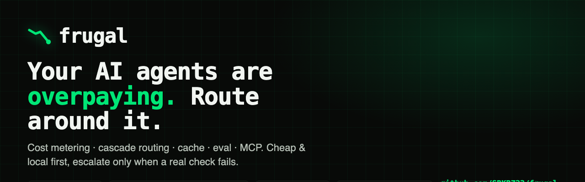

# Frugal

<p align="center"></p>

**🇷🇺 Русский · [🇬🇧 English](README.md)**

[](https://github.com/SRKRZ23/frugal/actions/workflows/ci.yml)
[](LICENSE)
[](pyproject.toml)


**Гоняй AI-агентов дёшево, локально и с проверкой.**

🌐 **[Живой сайт](https://frugal-cost-router.netlify.app)** · 🎞 **[Интерактивная презентация](https://frugal-cost-router.netlify.app/deck.html)**

Frugal — drop-in слой для LLM-приложений и агентов. Он делает любую нагрузку:

- 💸 **дешевле** — считает каждый вызов, каскад cheap→frontier, жёсткий бюджет-cap
- 🏠 **локальной** — приватное/простое уходит на модель на устройстве (Ollama / vLLM / AMD ROCm)
- ✅ **проверяемой** — офлайн semantic-assert, детект дрейфа, RAG-проверки для CI
- 🔎 **самоосознанной** — MCP-сервер, где агент видит собственный `$/токен`

Один пакет, **девять модулей**, **без API-ключей** — всё работает офлайн на детерминированном
mock-провайдере: можно попробовать, протестировать и показать сразу.

```bash
pip install -e .
frugal demo          # сквозное демо, полностью офлайн
```

## Смотри, как падает счёт

```text
  FRUGAL — live cost   (gpt-4o-mini дешёвый → gpt-4o эскалация, реальные цены)

  обработано запросов :  2400
  только frontier     : $ 10.2000  ██████████████████████████████████
  frugal              : $  0.8262  ██
  сэкономлено 91.9%  ($9.3738 остались у тебя)
```

`python examples/live_cost_demo.py` (анимация) или `--cast` для записи
[asciinema](https://asciinema.org). Реальные цены; точная экономия зависит от нагрузки
и сигнала уверенности — см. [разбор экономии на живом сайте](https://frugal-cost-router.netlify.app/#savings).

## Проверь сам за 10 секунд

Не верь числам — воспроизведи. Ключи не нужны:

```bash
pip install -e . && frugal demo        # сквозь, офлайн, ~2с
python benchmarks/run_all.py           # офлайн-таблица бенчмарков
python benchmarks/stress_test.py       # 8 измерений: потокобезопасность, ReDoS, фаззинг, память
python benchmarks/stress_deep.py       # 6 adversarial-измерений: злой вход, гонки (diamond)
python benchmarks/cost_model.py        # расчёт экономии на реальных ценах
```

Есть модели на кластере/Ollama? Перегони то же сравнение на **своих** моделях и оспорь:
`FRUGAL_MODELS=... python benchmarks/bench_models.py`. Любое число здесь — в одной команде
от проверки. (См. [WEAKNESSES.md](WEAKNESSES.md) — что числа доказывают, а что нет.)

## Модули

| Модуль | Что делает |
|---|---|
| `frugal.meter` | учёт cost/tokens/latency + бюджет-cap; O(1); bounded-память; zero-overshoot reserve |
| `frugal.route` | каскад cheap→escalate; confidence: **logprob (бесплатный)** / verifier / self-consistency |
| `frugal.cache` | второй рычаг экономии — повтор/похожий промпт = $0 |
| `frugal.local` | роутинг local↔cloud по cost/privacy/complexity; 0 утечек приватного |
| `frugal.eval` | офлайн semantic-assert, drift, LLM-судья + панель судей |
| `frugal.rag` | retrieval hit-rate / faithfulness / citation-coverage |
| `frugal.mcp` | MCP-сервер (агент видит свой $/токен) + guard (PII/injection) |
| `frugal.gateway` | OpenAI-совместимый прокси: meter+budget+route, стриминг (SSE) |
| `frugal.economics` | предупреждает, если пара cheap/frontier не окупит роутинг |

## Быстрый старт

```python
from frugal import Meter, MockProvider, cascade
from frugal.eval import assert_semantic
from frugal.mcp import FrugalMCP

provider = MockProvider()          # замени на get_openai(...) / get_ollama(...)
meter = Meter(budget_usd=0.50)

r = cascade("привет", provider, meter)          # -> остаётся на дешёвой модели
r = cascade("докажи этот дизайн по шагам", provider, meter)  # -> эскалирует

assert_semantic("Париж — столица", "Столица — Париж", threshold=0.4)
print(FrugalMCP(meter).call("get_cost_summary"))
```

## Экономия (реальные цены, июль 2026)

- **Cloud (GPT-4o-mini → GPT-4o):** ~**75–91%** экономии в зависимости от смеси нагрузки и сигнала.
- **Local ($0-токен) → GPT-4o:** до ~**88–97%** (self-consistency бесплатен при $0/токен).
- ⚠️ **Где НЕ окупается:** каскад + ре-сэмплинг при малом разрыве цен (Haiku→Sonnet, ~3×)
  может **терять деньги** (−7%). Frugal это считает и **предупреждает**. Полная математика:
  [разбор экономии на живом сайте](https://frugal-cost-router.netlify.app/#savings) (или запусти `cost_model.py`).
- **Live на кластере:** против обычного прокси (всё→strong) Frugal сделал **вдвое меньше**
  сильных вызовов → **−53.9% стоимости, −32.5% латентности** на тех же промптах.

## Честность

- **56 тестов**, 8-мерный стресс + 6-мерный adversarial + фаззинг + FastAPI-конкурентность.
- **8 реальных багов** найдено и починено нашими же тестами (потокобезопасность, O(n²)-метринг,
  unicode-суррогаты, сломанный HTTP-слой FastAPI и др.).
- 0 runtime-зависимостей. Честный аудит слабостей: [WEAKNESSES.md](WEAKNESSES.md).
- Замерено на кластере: 3B ≈ 14B на 83% сложных задач (100% простых), ~4.7–11× быстрее.
  Это **LLM-судья, не человек**, малый N — мы это прямо пишем.

## Для enterprise

Инференс — уже **~85% enterprise AI-бюджета**. Uber спалил весь AI-coding бюджет 2026 к апрелю; одна
фирма — **$500M на Claude за месяц**; CEO Palantir называет token-pricing «сломанным». Frugal это
обходит. При спенде **$10M/мес** это моделируемые **$60–90M/год** экономии.
→ Полный ростер (Meta · Amazon · Google · xAI · Uber · Palantir · Klarna …), таблица экономии по спенду
и кейсы, под которые он создан: **[секция Enterprise на живом сайте](https://frugal-cost-router.netlify.app/#enterprise)**
· **[интерактивная дека](https://frugal-cost-router.netlify.app/deck.html?lang=ru)**.

## Автор

**Sardor Razikov** — независимый AI/ML-инженер (Ташкент). On-prem LLM-инфраструктура,
cost-эффективный инференс, сжатие. Открыт к acquisition, инвестициям, партнёрству и
спонсорству железа.
[GitHub](https://github.com/SRKRZ23) ·
[LinkedIn](https://linkedin.com/in/sardor-razikov-569a5327b) ·
[X](https://x.com/SardorRazi99093) · razikovsardor1@gmail.com · razikovs777@gmail.com

## Лицензия

Apache-2.0. © 2026 Sardor Razikov.
